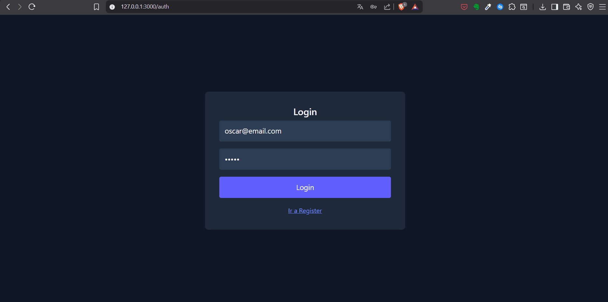

# Sciobox

## 📌 Descripción

Sciobox es una aplicación web full-stack que permite gestionar usuarios y recursos web mediante una API REST.

## 🎬 Demo



## 🛠️ Stack principal

* Backend: Go (Fiber + GORM)
* Frontend: React (Vite), Tailwind CSS
* Base de datos: PostgreSQL
* Contenerización: Docker

---

## 🚀 ¿Cómo ejecutar el proyecto?

### 🧰 Requisitos

* Docker → https://www.docker.com/

---

### 📥 1. Clonar repositorio

```bash
git clone https://github.com/mobml/sciobox
cd sciobox
```

---

### ▶️ 2. Ejecutar

```bash
docker-compose up --build
```

> En Linux:

```bash
sudo docker compose up --build
```

---

### 🌐 3. Acceso

```
http://127.0.0.1:3000
```

> ⚠️ Nota: En algunos sistemas `localhost` puede resolverse a IPv6 y causar problemas. Se recomienda usar `127.0.0.1`.

---

## 🧱 Arquitectura

```
[ React (Vite) ] → [ API REST (Go Fiber) ] → [ PostgreSQL ]
```

* El frontend se compila y se sirve como archivos estáticos desde el backend
* Se utiliza una sola origin → no hay CORS en producción

---

## ⚙️ Variables de entorno

Archivo `.env` en la raíz:

```env
DB_USER=admin
DB_NAME=sciobox_db
DB_PASSWORD=admin_sciobox
DB_HOST=db
DB_PORT=5432
JWT_SECRET=...
PORT=3000
ENV=production
```

---

## 🐳 Docker

* Backend + frontend en una sola imagen
* PostgreSQL como servicio independiente
* Volumen persistente para datos
* Inicialización automática de la base de datos

---

## 🗄️ Base de Datos

* Motor: PostgreSQL
* Extensión: `pgcrypto` (UUID)

### 🧩 Diseño

El sistema sigue un modelo relacional normalizado (3FN), evitando redundancias y garantizando integridad.

#### Entidades:

* **users** → usuarios del sistema
* **folders** → organización de recursos
* **resources** → enlaces y metadatos

#### Relaciones:

* Un usuario tiene muchas carpetas
* Un usuario tiene muchos recursos
* Un recurso puede pertenecer a una carpeta (opcional)

#### Características:

* UUID como clave primaria
* Claves foráneas para integridad
* ENUM para roles (`user`, `admin`)


### 📐 Esquema (DBML)

```dbml
Enum user_role {
  user
  admin
}

Table users {
  id uuid [pk]
  name varchar [not null]
  email varchar [not null, unique]
  password_hash varchar [not null]
  role user_role [default: 'user']
  created_at timestamp
}

Table folders {
  id uuid [pk]
  name varchar [not null]
  user_id uuid [not null]
  created_at timestamp
}

Table resources {
  id uuid [pk]
  title varchar [not null]
  url text [not null]
  description text
  image_url text
  folder_id uuid
  user_id uuid [not null]
  created_at timestamp
  updated_at timestamp
}

Ref: folders.user_id > users.id
Ref: resources.user_id > users.id
Ref: resources.folder_id > folders.id
```

🔗 Diagrama visual:
https://dbdiagram.io/d/Esquema-sciobox-69e116dc8089629684b6dd58

---

## 🔌 API

### 🔑 Autenticación

* JWT requerido en rutas protegidas
* Header:

```
Authorization: Bearer <token>
```

Base URL:

```
/api/v1
```

### 🔐 Auth

| Método | Endpoint         | Descripción |
| ------ | ---------------- | ----------- |
| POST   | `/auth/register` | Registro    |
| POST   | `/auth/login`    | Login       |


### 👤 Perfil

| Método | Endpoint   | Descripción     |
| ------ | ---------- | --------------- |
| GET    | `/profile` | Obtener usuario |
| PUT    | `/profile` | Actualizar      |
| DELETE | `/profile` | Eliminar        |

### 📁 Folders

| Método | Endpoint       | Descripción |
| ------ | -------------- | ----------- |
| POST   | `/folders`     | Crear       |
| GET    | `/folders`     | Listar      |
| PUT    | `/folders/:id` | Renombrar   |
| DELETE | `/folders/:id` | Eliminar    |

### 🔗 Resources

| Método | Endpoint                      | Descripción          |
| ------ | ----------------------------- | -------------------- |
| POST   | `/resources`                  | Crear (con scraping) |
| GET    | `/resources`                  | Listar               |
| PUT    | `/resources/:id`              | Actualizar           |
| DELETE | `/resources/:id`              | Eliminar             |

> El backend intenta extraer metadatos automáticamente (título, descripción, imagen).


### 🛡️ Admin

| Método | Endpoint       | Descripción     |
| ------ | -------------- | --------------- |
| GET    | `/admin/users` | Listar usuarios |

### ⚠️ Códigos HTTP

* 200 OK
* 201 Created
* 400 Bad Request
* 401 Unauthorized
* 403 Forbidden
* 404 Not Found
* 500 Internal Server Error

## 🧪 Notas

* Todo el sistema corre con Docker
* No requiere configuración adicional
* El frontend usa rutas relativas (`/api/...`)

---

## 📌 Decisiones Técnicas

* Uso de rutas relativas para evitar CORS
* Retry en conexión a DB (problema común en Docker)
* Backend sirve frontend → despliegue simplificado
* Diseño desacoplado → fácil escalabilidad futura

---